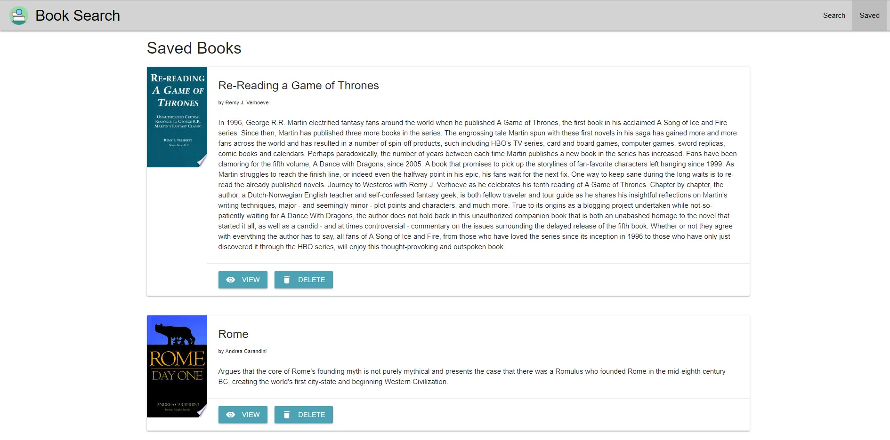

# Book Search

This is a a full-stack MERN web application to search for books by title, view the books on the Google Books website, and save books to the database so they can be reviewed or purchased later. This is built using Mongo DB (mongoose), React, Node, Express, and Google Books API. Also utilizing Socket.IO to notify all users when a book is saved. 

The project is deployed [here](https://noel-book-search.herokuapp.com/).

# Steps to Run Application

1. On the `Search` Page enter the title of the book you would like to search and hit enter or press the `Search` button.

    

2. If no books are found then a toast will appear notifying the user.

    

3. After a successful search the results will display in the `Search Results` section. The user can click on the `view` button which will take them to the Google Books page for the book. 

    

4. The user can click on the `save` book button to save the book to the database to view or purchase to book later via the `Saved` page. 

    

5. All users currently in the application will be notified that a new book was saved and the title of that book. 

    

5. The `Saved` page will display all books saved by all users in the database. 

    

6. On the `Saved` page the user can press the `delete` button on a book to delete that book from the database and remove it from the `Saved` page. 

    

# Create React Express App

## About This Boilerplate

This setup allows for a Node/Express/React app which can be easily deployed to Heroku.

The front-end React app will auto-reload as it's updated via webpack dev server, and the backend Express app will auto-reload independently with nodemon.

## Starting the app locally

Start by installing front and backend dependencies. While in this directory, run the following command:

```
npm install
```

This should install node modules within the server and the client folder.

After both installations complete, run the following command in your terminal:

```
npm start
```

Your app should now be running on <http://localhost:3000>. The Express server should intercept any AJAX requests from the client.

## Deployment (Heroku)

To deploy, simply add and commit your changes, and push to Heroku. As is, the NPM scripts should take care of the rest.
